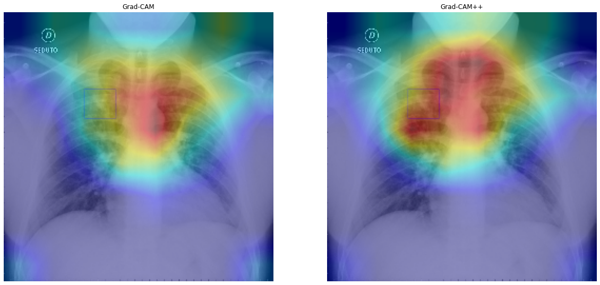

# Covid-19 Detection

Nesse projeto foi desenvolvido um sistema capaz de detectar se um paciente está com pneumonia, coronavírus ou saúdavel.

## O problema proposto

A ideia desse projeto é utilizar imagens de raios x do tórax para verificar se o paciente está doente devido ao coronavírus ou devido a pneumonia. O conjunto de dados é composto por raios x de pacientes saudaveis, raios x de pacientes doentes devido a pneumonia e raios x de pacientes doentes devido ao coronavírus.

O problema foi estruturado como um problema de classificação, nesse problema deve-se verificar se o paciente está doente devido ao coronavírus, pneumonia ou se está saúdavel.

## Conjuntos de dados

As imagens que compõe o conjunto de dados são como a imagem abaixo.


Foram utilizados dois conjuntos de dados, o primeiro deles é um conjunto de dados contendo pacientes doentes devido ao coronavírus e o segundo devido a pneumonia. Os dados do segundo conjunto de dados não foram utilizados em sua totalidade para não desbalacear o problema.

### Conjunto de dados de treino

O conjunto de dados de treino é composto por 420 imagens.

### Avaliação do modelo

Para se avaliar a capacidade do modelo optou-se por se utilizar a acurácia.

## Descrição da solução

Todo o projeto foi desenvolvido por meio da plataforma Google Colab, a qual disponibiliza acesso a uma GPU de alto desempenho gratuitamente.

Diversos modelos de redes neurais convolucionais foram testados afim de se maximizar o desempenho obtido na classificação. Nesse projeto um dos melhores desempenhos foi obtido pelo modelo EfficientNet-B7 com *data augmenation*. Esse modelo atingiu uma acurácia média de 98% (média dos resultados de uma validação cruzada) de 0.83.

Para evitar o *overfitting* do modelo algumas técnicas de *data agumentation* foram utilizadas (os nomes correspondem as funções da biblioteca *albumentations*):

- RGBShift();
- Blur();
- RandomGamma();
- RandomBrightness();
- RandomContrast();
- VerticalFlip();
- HorizontalFlip();
- Normalize();
- CoarseDropout().

Dois experimentos foram realizados:

- Experimento 1: arquitetura EfficientNet-B7 sem *data augmentation*;
- Experimento 2: arquitetura EfficientNet-B7 com *data augmentation*;

Como se trata de um problema de classificação a função custo utilizada é a CrossEntropyLoss().
### EfficientNet

A arquitetura EfficientNet-B7 utilizada nesse projeto pode ser encontrada [aqui](https://github.com/lukemelas/EfficientNet-PyTorch).

### Resultados

Os resultados obtidos pelo modelo EfficientNet-B7 em cada um dos experiementos pode ser visto na tabela abaixo.

Devido ao pequeno número de dados ainda não foi utilizada um conjunto de testes para verificação dos resultados do modelo. Os resultados apresentados abaixo são a média das precisões e das revocações (*recalls*) obtidos em uma validação cruzada de 5 *folds*.

Para o experimento 1 (sem *data augmentation*) se obteve os seguintes resultados:

| Classe     | Precisão (%) | Revocação (%)|
|------------|-------   |------------|
| 0          | 95,8     | 81,2       |
| 1          | 88,6     | 99,2       |
| 2          | 87,6     | 86,4         |

Para o experimento 2 se obteve os seguintes resultados:

| Classe     | Precisão (%) | Revocação (%)|
|------------|-------   |------------|
| 0          | 97,8     | 96,4       |
| 1          | 98,0     | 100        |
| 2          | 97,8     | 97         |  

### Localização dos pontos-chave para a predição

Utilizando a técnica Grad-CAM e a técnica Grad-CAM++ foi possível gerar mapas de calor que representam as regiões da imagem de entrada que mais contribuiram para o valor da saída. Abaixo pode-se verificar os resultados (esse raio-x é de um paciente doente devido ao coronavírus).



## Como usar

### Requirements

- Python 3;
- Pytorch;
- NumPy;
- Albumentations;
- SciKit Learn;
- Pandas.

### Dowload de dados

Após clonar o repositório é necessário realizar o download do conjunto de dados e descompactar tudo dentro de uma chamada *data*. Após descompactar deve-se realizar os ajustes necessários nos arquivos *datasets.py* e *train.py*.

### Treinamento do modelo

Para treinar o modelo é necessário rodar o aquivo *train.py* atráves do seguinte comando:

```
python3 train.py
```

## Descrição dos arquivos do projeto

### Datasets

Essa pasta contém todas as funcionalidades necessárias para manipulação dos dados. Aqui são criados os *data loaders* para possibilitar o treinamento e a avaliação em *batches* do modelos.

### Models

Aqui ficam os arquivos resposáveis pela arquitetura do modelo e por todo o controle do treinamento/avaliação.

### Utils

Aqui ficam arquivos de utilidades, como funções para liberar a memória da GPU.

### Metrics

Aqui são definidas as métricas a serem utilizadas no projeto.

### Optimizers

Nessa pasta são definidos otimizados customizados.

### Configs

Nessa pasta fica um arquivo *.json* com as principais configurações para a rede neural e para o treinamento.


