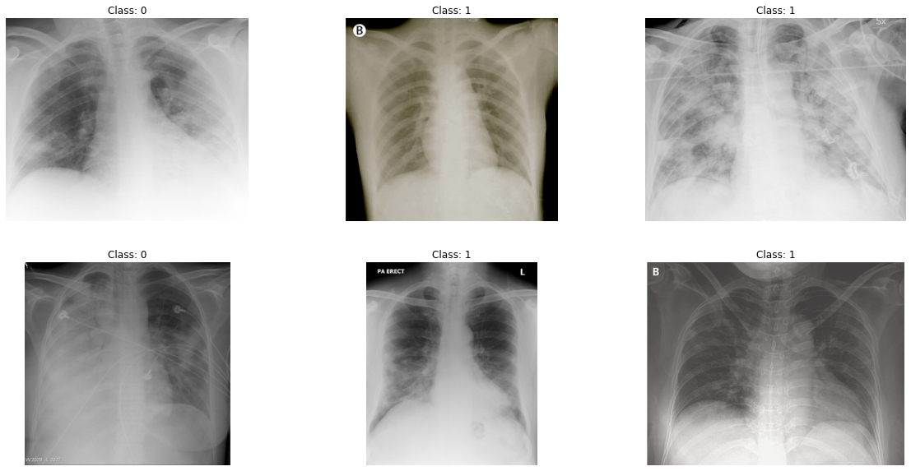

# Covid-19 Detection

Nesse projeto foi desenvolvido um sistema capaz de detectar se um paciente está doente devido ao Covid-19 ou não.

## O problema proposto

A ideia desse projeto é utilizar imagens de raios x do tórax para verificar se o paciente está doente devido ao Covid-19 ou não. O conjunto de dados é composto por raios x de pacientes saudaveis, raios x de pacientes doentes devido a outras doenças e raios x de pacientes doentes devido ao Covid-19.

O problema foi estruturado como um problema de classificação binária, predizendo se o paciente está doente devido ao Covid-19 ou não.

## Conjuntos de dados

As imagens que compõe o conjunto de dados são como a imagem abaixo.



Foram utilizados dois conjuntos de dados, o primeiro deles é um conjunto de dados contendo pacientes doentes devido ao Covid-19 e o segundo devido a pneumonia. O segundo conjunto de dados foi utilizado para aumentar os dados disponíveis bem como realizar o balanceamento das classes.

### Conjunto de dados de treino

O conjunto de dados de treino é composto por 152 imagens.

### Avaliação do modelo

Para se avaliar a capacidade do modelo optou-se por se utilizar a métrica AUC.

## Descrição da solução

Todo o projeto foi desenvolvido por meio da plataforma Google Colab, a qual disponibiliza acesso a uma GPU de alto desempenho gratuitamente.

Diversos modelos de redes neurais convolucionais foram testados afim de se maximizar o desempenho obtido na classificação. Nesse projeto um dos melhores desempenhos foi obtido pelo modelo EfficientNet-B7 sem *data augmenation*. Esse modelo atingiu uma métrica *F1-score* média (média dos resultados de uma validação cruzada) de 0.83.

Para evitar o *overfitting* do modelo algumas técnicas de *data agumentation* foram utilizadas (os nomes correspondem as funções da biblioteca *albumentations*):

- RGBShift();
- Blur();
- RandomGamma();
- RandomBrightness();
- RandomContrast();
- VerticalFlip();
- HorizontalFlip();
- Normalize();
- CoarseDropout().

Dois experimentos foram realizados:

- Experimento 1: arquitetura EfficientNet-B7 sem *data augmentation*;
- Experimento 2: arquitetura EfficientNet-B7 com *data augmentation*;

Como se trata de um problema de classificação binária a função custo utilizada é BCEWithLogitsLoss() a qual incorpora uma camada sigmóide e a função custo BCELoss().	

### EfficientNet

A arquitetura EfficientNet-B7 utilizada nesse projeto pode ser encontrada [aqui](https://github.com/lukemelas/EfficientNet-PyTorch).

## Resultados

Os resultados obtidos pelo modelo EfficientNet-B7 em cada um dos experiementos pode ser visto na tabela abaixo.

Devido ao pequeno número de dados ainda não foi utilizada um conjunto de testes para verificação dos resultados do modelo.

| Experiment | Train | Validation |
|------------|-------|------------|
| 1          | 0.99  | 0.81       |
| 2          | 0.99  | 0.83       |

Para o experimento 2 se obteve os seguintes resultados durante a validação:

| Sensibilidade (reccal) | Valor preditivo positivo (precision) | 
|------------|-------|
| 1          | 0.8  |      

###

## Como usar

### Requirements

- Python 3;
- Pytorch;
- NumPy;
- Albumentations;
- SciKit Learn;
- Pandas.

### Dowload de dados

Após clonar o repositório é necessário realizar o download do conjunto de dados e descompactar tudo dentro de uma chamada *data*.

### Treinamento do modelo

Para treinar o modelo é necessário rodar o aquivo *train.py* atráves do seguinte comando:

```
python3 train.py
```

## Descrição dos arquivos do projeto

### Datasets

Essa pasta contém todas as funcionalidades necessárias para manipulação dos dados. Aqui são criados os *data loaders* para possibilitar o treinamento e a avaliação em *batches* do modelos.

### Models

Aqui ficam os arquivos resposáveis pela arquitetura do modelo e por todo o controle do treinamento/avaliação.

### Utils

Aqui ficam arquivos de utilidades, como funções para liberar a memória da GPU.

### Metrics

Aqui são definidas as métricas a serem utilizadas no projeto.

### Optimizers

Nessa pasta são definidos otimizados customizados.

### Configs

Nessa pasta fica um arquivo *.json* com as principais configurações para a rede neural e para o treinamento.


